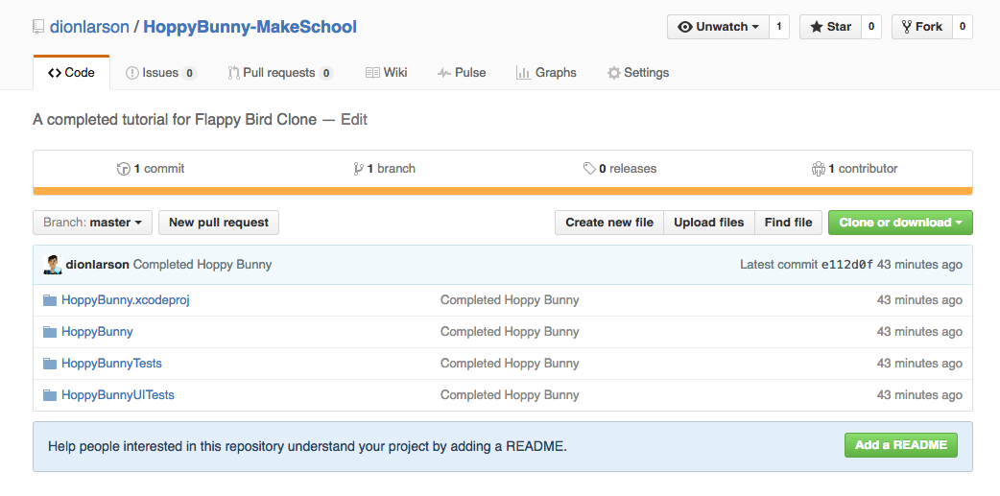
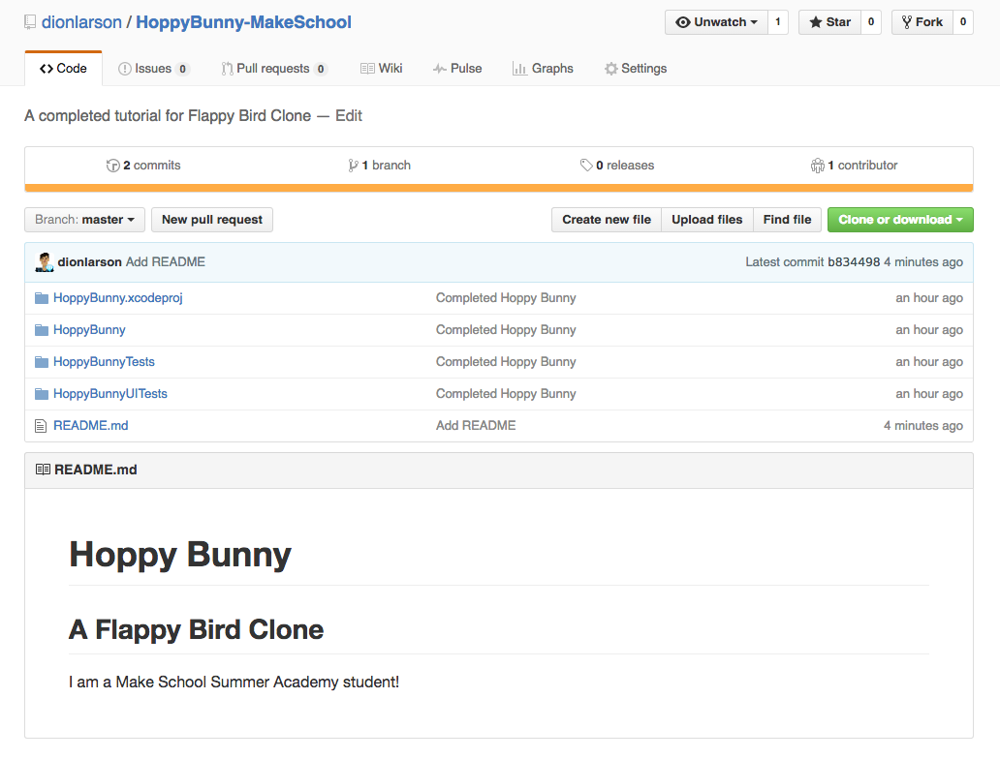

When using Git, each project gets its own *repository*. The repository (or *repo*) holds the project and its commits (snapshots of the files). Since Git is *distributed*, you usually have a *local repository* and a *remote repository*. The local repository exists on your computer. The remote repository is usually hosted by a service such as [GitHub](https://www.github.com/). This means you'll still have a copy of your project if your computer goes missing or stops working.

## Create a GitHub account

Before we go any further, you will need to create a GitHub account. Your GitHub account will function as a professional portfolio of your work so be sure to choose a professional username that you won't be embarrassed to put on your résumé!

> [action]
> Go to [GitHub](https://github.com/join) and create an account with a **professional username**. Choose *Free* on step two.
>
> You can skip this step if you already have a GitHub account!

# Download GitHub Desktop

There are a few ways to use Git but we would like everyone to get started with _GitHub Desktop_. It's a great, graphical interface and allows you to use most of Git's features.

> [action]
>
1. Download GitHub Desktop from [here](https://desktop.github.com/).
1. "Unzip" the downloaded `.zip` file by double-clicking on it.
1. Open up your applications folder and drag _GitHub Desktop_ into it
1. Drag _GitHub Desktop_ from the applications folder onto your dock so you can access it easily.

# Getting started

We need to set up _GitHub Desktop_ before we can create a repository.

> [action]
>
1. Open up _GitHub Desktop_ and start going through the setup prompts.
1. Sign into your GitHub account.
1. Fill out your full name and email address (be sure to use the one you signed up for GitHub with).
1. Skip adding any existing repositories.

# Committing and pushing

Earlier, we talked about *commits* or snapshots. We already finished a project so we want to create a single commit of the final results. When we do that we'll also *push* that commit to GitHub so it's backed up and added to our quickly growing portfolio. We'll do this for each project we've already finished and then start doing it as we build new projects!

There are three steps to getting your files onto GitHub: *staging*, *committing*, and *pushing*. We will *stage* all the project files (by making sure they are checked to be included in the commit). This is like arranging the subjects of your snapshot (hence "staging" a photograph). A *commit* only includes files that are staged, so if we do not stage any files, we will not commit anything. Once all the files are in *staging*, we will *commit* (take the snapshot) and *push* (share the snapshot with GitHub). This will create a *commit* in our local repository and *push* it to our remote repository on GitHub.

# Creating your first repository and committing the files

Before we create our first repository, let's make sure we are organized.

> [action]
> ## Getting organized
>
1. Save everything and close Xcode
1. Create a new folder somewhere to store all your projects if you don't already have one. Your Desktop or Documents would be a good place! Name the new folder `Make School Projects` and drag all your previous projects into it.

<!--  -->

> [info]
> You can create a new folder by right-clicking and selecting `New Folder`. You can rename a folder by right-clicking on it and selecting `Rename`.

Alright! Now that we have organized our projects, let's create a new repository!

> [info]
> The videos reference `Tip Pro`, the first project for the apps track. If you are in the games track, use `Flappy Bird` instead. If you are in the VR track, use `Game Of Life` instead.

<!--  -->

> [action]
> ## Initial commit
>
1. Open _GitHub Desktop_ and your projects folder.
1. Click `Create New Repository`, fill out the name and choose your projects folder as `Local Path`.
1. Check `Initialize this repository with a README`. And select `Swift` under `Git Ignore`. Keep `License` as `None` and click `Create Repository`.
1. Open your project folder and you'll find a new folder inside of there. Its name will match your repository name. Open it and drag your first project into it.
1. Go back to _GitHub Desktop_ and you should see a bunch of "changed files" in the left hand sidebar.
1. Make sure all the files are checked. If they are checked, then they are *staged* and ready to be *committed*!
1. Enter a short message in `Summary`. This will usually describe what you changed between the last commit and this new one. It is best for the commit message to fill in the blank for the sentence "This commit will \_\_\_\_\_\_\_\_". In our case, we are committing a completed project so something like "Add completed <project name>" would work.
1. Click `Commit to master`.
1. Most of the files in "changed files" should disappear (you don't need to worry about `.DS_Store` files).
>

Congrats! You just created your first local repository! There is just one problem... it has not been *pushed* to *GitHub* yet! This repository only exists on your computer. The outline of a circle means that commit has not yet been *pushed*. Once it's *pushed*, it will be filled in.

> [info]
> If you only wanted to commit a few changed files, you could pick and choose by unchecking the files to *unstage* them. In this case we wanted all of them so we left them all checked (or *staged*).

# Creating a remote repository

So, how do we create a remote repository on _GitHub_? Lucky for us, this is the _GitHub Desktop_ app and we don't even need to open a browser!

> [action]
>
1. Click the `Publish repository` button at the top right.
1. In the popup, give your repository a name. This should be the name of your project.
1. You can enter a short description as well if you would like. This is a good place to describe your project, what language you used (Swift), and what platform it was created for (iOS).
1. Uncheck `Keep this code private` for now. Your basic GitHub account will not allow for private repositories (see below for a potential way to get free private repositories).
1. Click `Publish Repository`
1. Watch the button show the progress. Once it changes to `Fetch origin`, that means you have successfully *pushed* your repository to GitHub!
>

If you want, you can even view the project on _GitHub_. Go to the `Repository` menu on the top bar and select `View on GitHub`. Your browser will open up directly to the repository. Now it's on _GitHub_ and you have started a development portfolio!

> [info]
>
## Getting private repositories for free
>
GitHub offers a [Student Pack](https://education.github.com/pack/) that contains a bunch of freebees (free private repositories, free domain for a year, free hosting, and more). If you are currently a student in high school or college, you should qualify. Go [here](https://education.github.com/pack/) and use your school email to request it. Once approved, you will be able to create private repositories for free!

# Commit and push again!

Now, what happens if you make changes to your project after your first commit? We just *commit* and *push* (sync) again!

> [action]
> Let's say you wanted to update the README file for your project. README's are displayed at the bottom of your _GitHub_ page and allow you to go into more detail about your project.
>
1. Open your project in Finder (`Repository` menu on top bar > `Show in Finder`) and open `README.md`.
1. Add a more detailed description, right now it only contains the title! Save it and close it.
1. You should see the `README` file *staged* and ready to be committed.
1. Put "Add a more detailed README" in the `Subject`.
1. Click `Commit to master` and your `Fetch origin` button should change to `Push origin`. This means you have local commits that have not been *pushed* to GitHub! This is dangerous because the updates only exist on your computer and are not backed up in the cloud!
1. Press the `Push origin` button and watch it push!
>

Right click on the project in the sidebar and select `View on GitHub`. Your browser will open up directly to the repository. What a pretty `README` :)

> [info]
> You will go through this *commit* and *push* (sync) cycle every time you finish making changes to your project. Remember to use descriptive commit subjects and keep it professional! Your commit subjects can be read on your _GitHub_.

# The rest of your projects

> [action]
> Go through the steps to create a repository, commit all the files, and create a remote repository on _GitHub_ for any other projects you have finished at Make School. Let's build that portfolio up!
