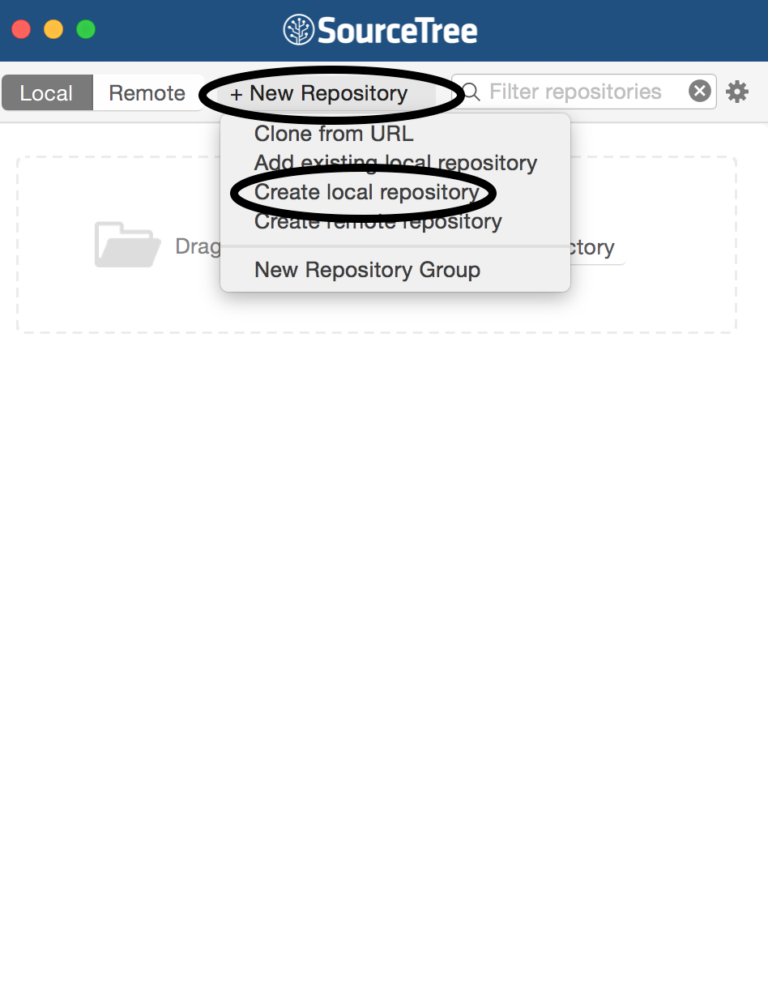
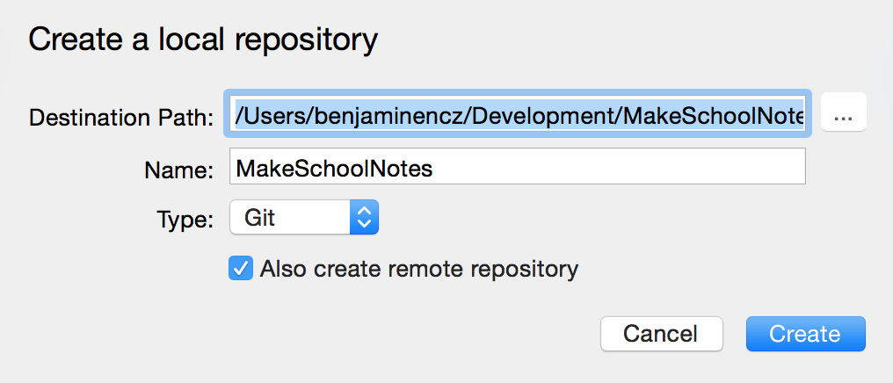
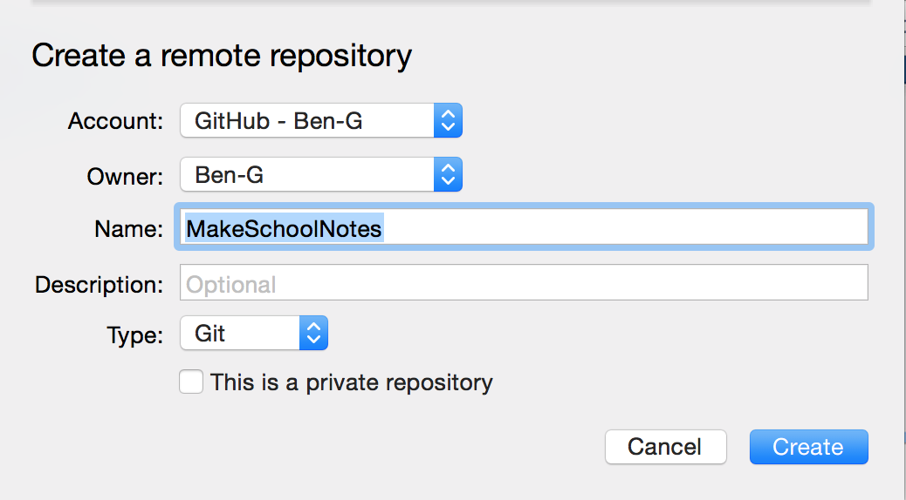
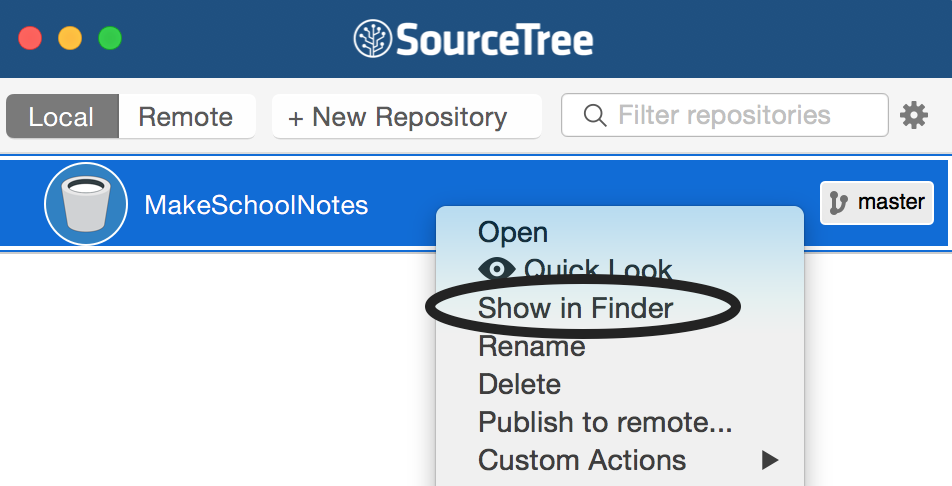
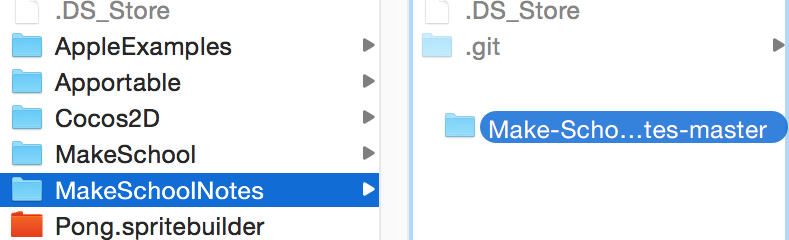
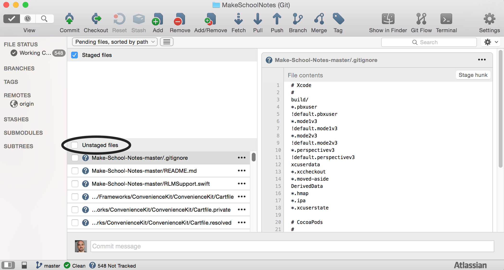
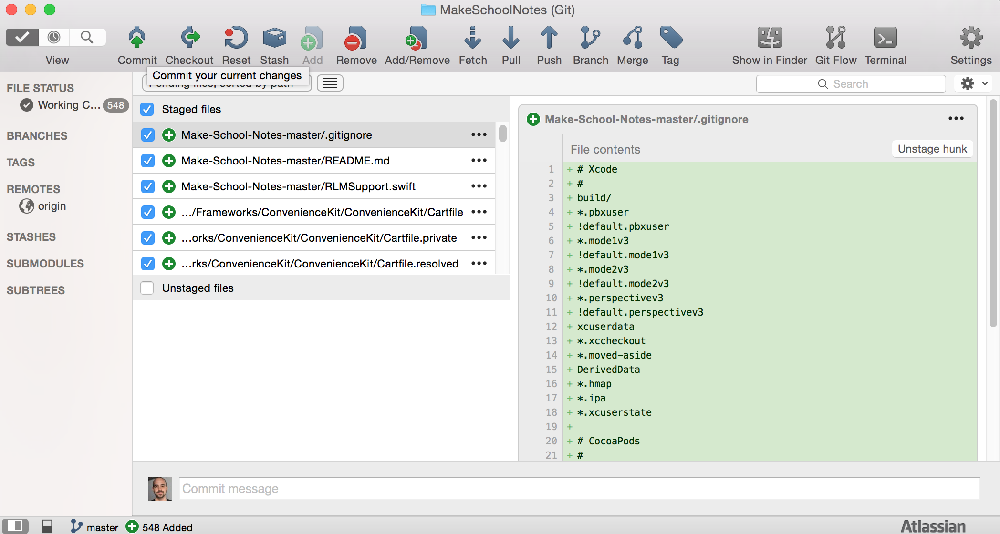
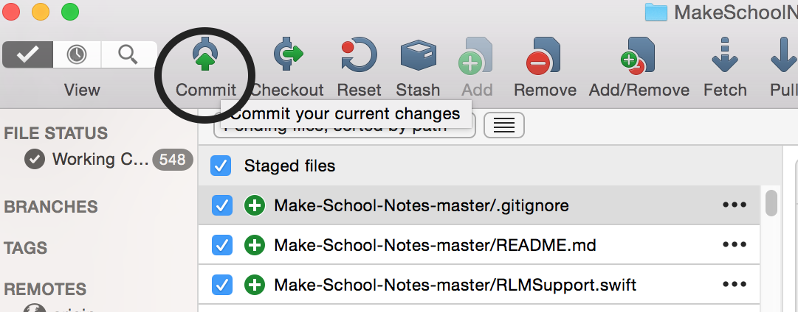
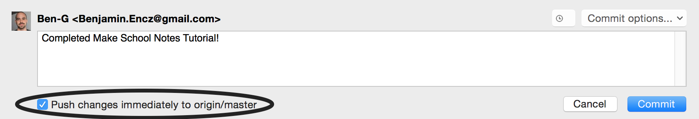
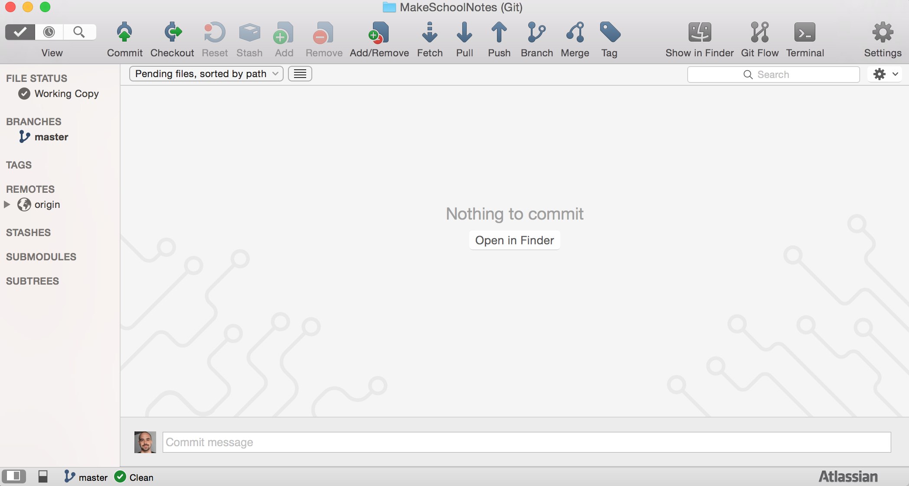

When using Git, each project get's its own *repository*. The repository (or *repo*) holds the project and its commits. Since Git is *distributed*, you general have a *local repository* and a *remote repository*. The local repository exists on your computer. The remote repository is usually hosted by a service such as [GitHub](https://www.github.com/). This means you'll still have a copy of your project if your computer goes missing or stops working.

#Create a GitHub account

Before we go any further, you will need to create a GitHub account. Your GitHub account will function as a professional portfolio of your work so be sure to choose a professional username that you won't be embarrassed to put on your résumé!

> [action]
> Go to [GitHub](https://github.com/join) and create an account with a professional username. Choose *Free* on step two.
>
> You can skip this step if you already have a GitHub account!

#Download SourceTree

There are a few ways to use Git but we want everyone to get started with SourceTree. It's a great, graphical interface and allows you to take advantage of all of Git's features.

> [action]
> Download SourceTree from [here](https://www.sourcetreeapp.com/).
>
> Open the `dmg` and drag it into your applications folder.
>
> Open your applications folder and drag SourceTree onto your dock so you can access it easily.

#Getting started

We need to set up SourceTree before we can create a repository.

> [action]
> Open up SourceTree and go through the set up prompts.
>
> Add your GitHub account and skip the reset of the set up.
>
> Go to `SourceTree > Preferences` and fill out your full name and email address (be sure to use the one you signed up for GitHub with).

#Creating your first repository

Now we're ready to create our first repository!

> [action]
> Press the `New Repository` button and select `Create local repository`.
>
> 
>
> A dialog should popup for creating a local repository.
>
> Choose a destination path that makes sense for you. It's usually best practice to keep all your projects organized in the same place so now is a good time to make a `Projects` folder of some sort. Name your repository `MakeSchoolNotes`.
>
> Be sure the type is set to `Git` and *Also create remote repository* is checked! This will give us another dialog to create a remote repository on Github.
>
> Press `Create`.
>
> 
>
> Use the same name for the remote repository as you used in the last step.
>
> Press `Create`.
>
> 

Congrats! You just created your first local and remote repositories! There is just one problem... there is nothing in them yet :(

#Adding your project

Let's fix our empty repository! We can't commit and push until we get our project into the repository folder.

> [action]
> Right click on your newly created repository and select `Show in Finder`.
>
> 
>
> The repository folder should have opened up.

Next, we're going to add our project. To make sure we are on the same page, [download the finished Make School Notes project here](https://github.com/MakeSchool/Make-School-Notes/archive/master.zip). Then unzip that project.

> Now drag in the entire unzipped first project.
>
> 

#Committing and pushing

Earlier, we talked about *commits* or snapshots. We already finished our first project so we want to create a single commit of the final results. When we do that we'll also *push* that commit to GitHub so it's backed up and added to our quickly growing portfolio.

We will *stage* all the project files first. A *commit* only includes files that are staged so if we do not stage any files, we will not commit anything. Once all the files are in *staging*, we will *commit* and *push*. This will create a *commit* in our local repository and *push* it to our remote repository on GitHub.

> [action]
> Double click on your repository in SourceTree to open it. Check the box next to *Unstaged files* to stage all the files.
>
> 
>
> You should now see something like this:
>
> 

> [info]
> If you only wanted to commit a few changed files, you could pick and choose from the unstaged files area. In this case we want all of them so we checked the box next to *unstaged files* to add them all at once.

> [action]
> Press the `Commit` button.
>
> 
>
> Add a commit message: "Completed Make School Notes Tutorial!".
>
> Make sure *Push changes immediately to origin/master* is checked. This will also add the commit to GitHub.
>
> Press `Commit`.
>
> 
>
> If you see this, that means you did it right!
>
> 
