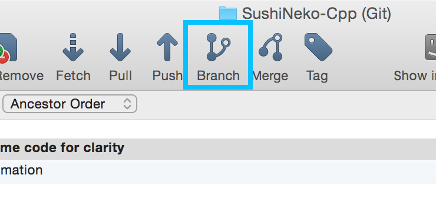
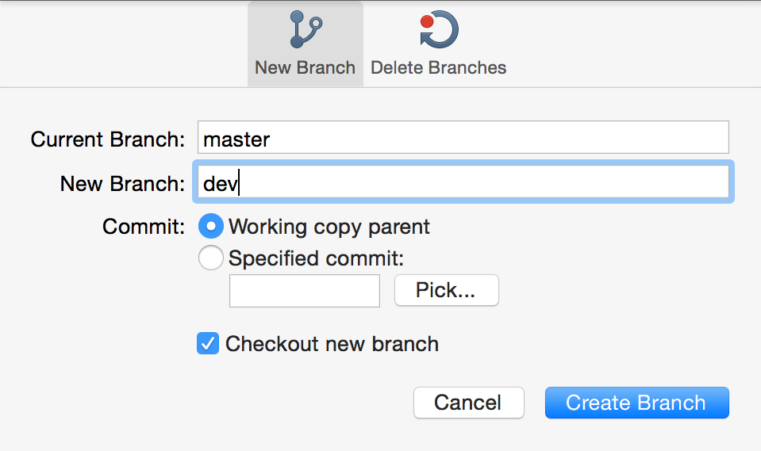
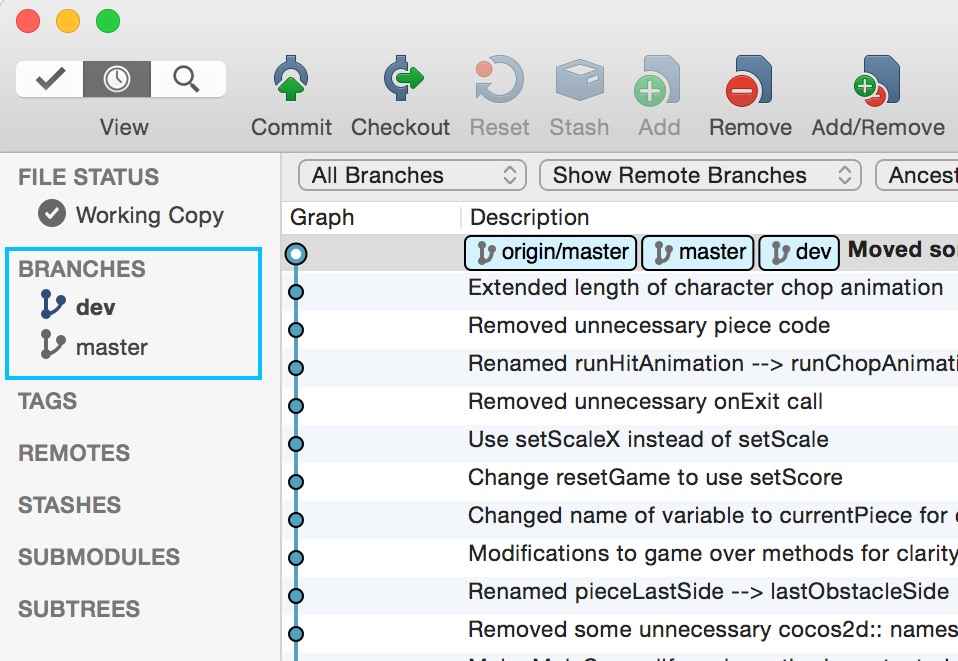
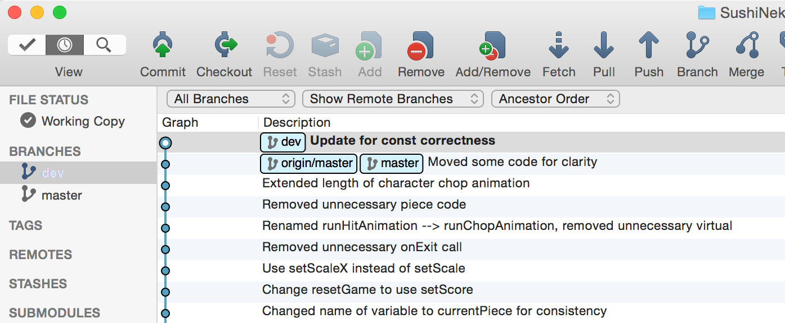
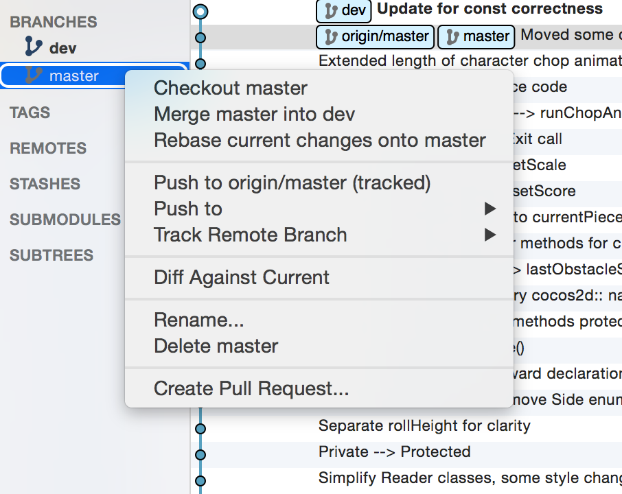
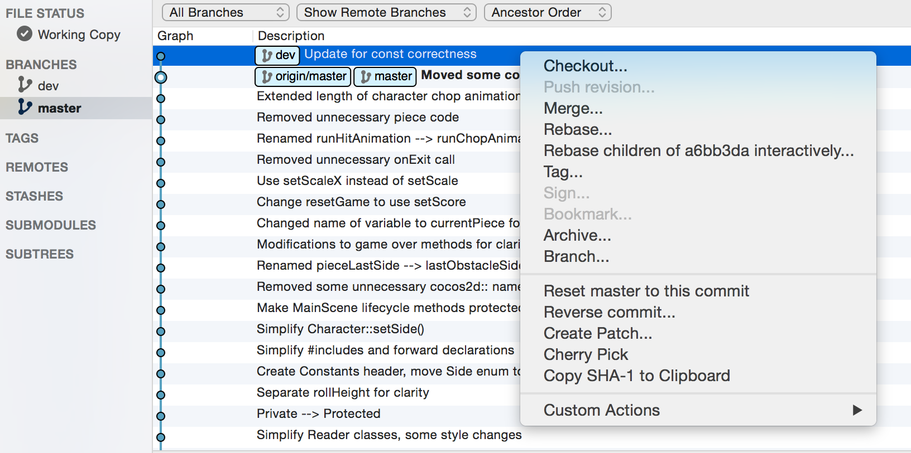
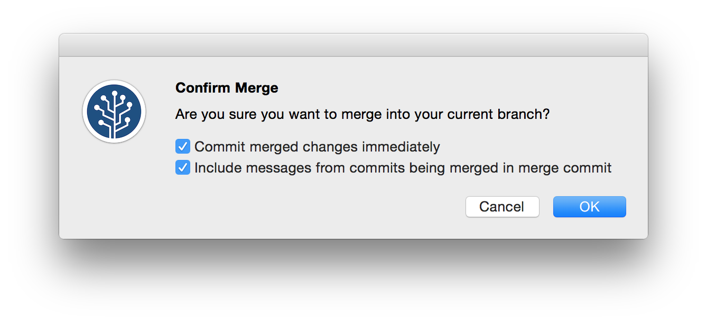
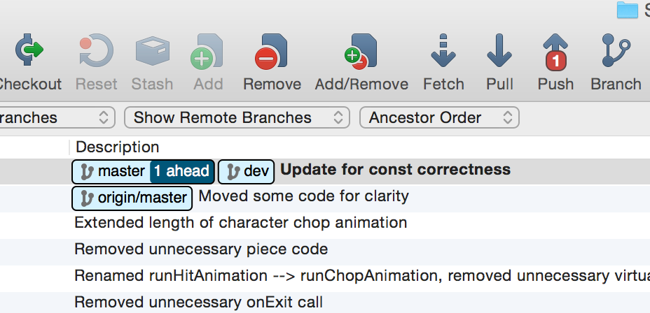
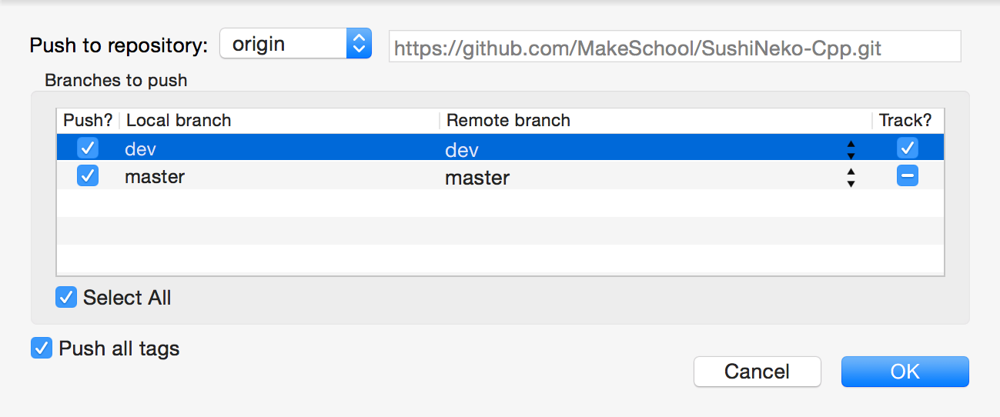
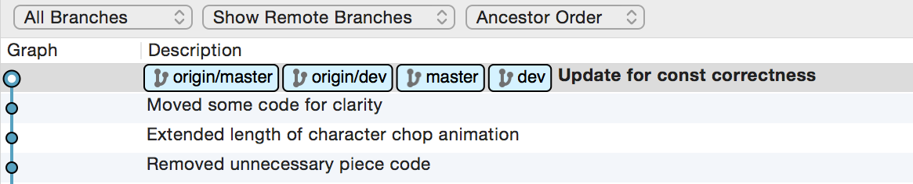

#Create a Dev Branch

The short version is that to create a branch in SourceTree, you click the branch button at the top.

A modal will pop up showing some options - you can name the branch there. The new branch will be based on the branch that is currently checked out.

If *working copy parent* is selected, then the new branch created will be at the same commit as the branch you have currently checked out. If you want, you can specify an older commit to branch from.

If you selected the *Checkout new branch* option then your new branch will be checked out automatically. You can tell which branch is the active one because it will be bolded in the left panel.

#Merge to Master

Once you have finished working on a new feature or have a working bugfix, then it's time to merge to the master branch.

Here there's a new commit to dev branch called "Update for const correctness."

To merge to `master`, first checkout `master` branch by right-clicking on `master` and selecting *Checkout master*.

Now that `master` is checked out, we can merge the `dev` branch commit by right clicking it and selecting *Merge*.

Click *OK* to execute the merge.

#Push to Github

Now SourceTree will show that both `master` and `dev` branches are at the same commit.

Notice that `master` is *1 ahead* of `origin/master`. `origin` is the name of our Github repository, so `origin/master` is the master branch on Github. We want that repository to track the changes to our local repository, so that if our hard drive fails, we don't lose our work.

Clicking the *Push* button will display these options:

By checking the `dev` branch checkbox, we will both create a dev branch in the Github repo and synchronize our local changes with it. We will keep `master` checked to ensure that we also push our local `master` branch changes.

Now SourceTree will show that all of our branches are at the same commit.

In general, even when working in the `dev` branch, you should push those changes to Github so that they're backed up.